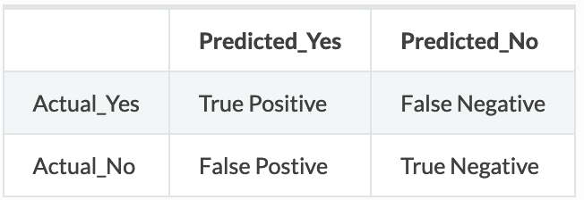
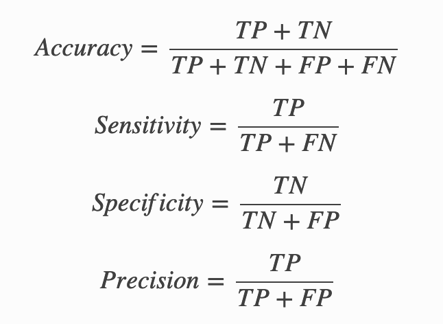

```{r setup, include=FALSE}
knitr::opts_chunk$set(echo = TRUE)
```

# Intro

## Background

Scotty is a ride-sharing business that operating in several big cities in Turkey. The company provides motorcycles ride-sharing service for Turkey’s citizen, and really value the efficiency in traveling through the traffic–the apps even give some reference to Star Trek “beam me up” in their order buttons.

Scotty provided us with real-time transaction dataset. With this dataset, we are going to help them in solving some forecasting and classification problems in order to improve their business processes.

## Problem

Scotty turns out being a very popular service in Turkey! The demands for Scotty began to overload, at some region and some times, and there was not enough driver at those times and places. Fortunately, we are know that we can use classification model to predict which region and times are risky enough to have this “no drivers” problem.

Create a classification model report that would be evaluated on next 7 days (Sunday, December 3rd 2017 to Saturday, December 9th 2017). Make prediction that should cover the predicted coverage status for each hour and each area: "sufficient" or "insufficient".

Our target is to get information which hour and area that have "insufficient" label, it mean we want to know which hour and area that really need more driver.

## Import Library

To solve this case we need import some package to help process and predict:

```{r message=FALSE}
library(GGally)
library(tidyverse)
library(lubridate)
library(scales)
library(rsample)
library(caret)
library(partykit)
# Smote for unbalanced data
library(DMwR)
# KNN modelling
library(class)
#ROCR
library(ROCR)
# Naive Bayes 
library(e1071)
# Visualize
library(plotly)
```

```{r}
source("script/matrix_result.R")
source("script/metrics.R")

confussionMatrixPlot <- function(table) {
  table %>% ggplot(aes(x = Prediction, y = Reference, fill = Freq)) +
  geom_tile() +
  geom_text(aes(label = Freq), fontface = "bold", color = "white") +
  theme_minimal() +
  theme(legend.position = "none")
}
 
```

# Read Data

Scotty provide transaction detail transaction from October 1st, 2017 to December 2nd, 2017 as train dataset. Based on this train data we can start process to make model and predict. 

```{r}
train <- read_csv("data/data-train.csv")
test <- read_csv("data/data-test.csv")
```

Lets check structure of train data:   

```{r}
glimpse(train)
```

The dataset includes information about:   

  * id: Transaction id   
  * trip_id: Trip id   
  * driver_id: Driver id   
  * rider_id: Rider id   
  * start_time: Rider id   
  * src_lat: Request source latitude   
  * src_lon: Request source longitude   
  * src_area: Request source area   
  * src_sub_area: Request source sub-area   
  * dest_lat: Requested destination latitude   
  * dest_lon: Requested destination longitude   
  * dest_area: Requested destination area    
  * dest_sub_area: Requested destination sub-area    
  * distance: Trip distance (in KM)    
  * status: Trip status (all status considered as a demand)    
  * confirmed_time_sec: Time different from request to confirmed (in seconds)   
  

Based on data above, we cant see coverage variable inside train data. but we found train data structure contain detail order from scotty. Some variable have mismatch datatype, we will try to change data type:

```{r}
train <- train %>%
  mutate(src_area = as.factor(src_area),
        src_sub_area = as.factor(src_sub_area),
        dest_area = as.factor(dest_area),
        dest_sub_area = as.factor(dest_sub_area),
        status = as.factor(status)
        )
```

# Data Wrangling

lets preview contain of data to understand more train data:

```{r}
head(train)
```

we found there's any NA value inside `trip_id` and `rider_id`, to make it more clear i will check NA value from all column before we take any action to data wrangling

```{r}
summary(is.na(train))
```

We found NA value only `trip_id` and `driver_id`, lets compare some row with NA value with non-NA row

```{r}
train[c(1:3),]
```

We found there's any relation why `trip_id` and `driver_id` NA, is because `status` is "nodrivers". and it will fullfil if status is "confirmed". It will be our clue to extract information of `coverage` data.    

Based on our target we have before, we will predict 7 days for each hour and each area. Why we dont specified time level only days, we cant explain detail which time get more dirver order. but if we make level into minute the data will too specific and result the data we have will make us confuse. So hourly interval is best time level to predict.

We can see from structure we dont have `hour` variable. We have `start_time` as users order time, we can extract specific level from Date, Days, Hour:

```{r}
train_hourly <- train %>%
  mutate(src_area = as.factor(src_area),
        date = date(start_time),
        day = as.factor(wday(start_time, label = TRUE, abbr = FALSE)),
        hour = as.factor(hour(start_time)))
```


```{r}
glimpse(train_hourly)
```

we have new variable `date` it explain date order happen,`day` it explain day, and `hour` it explain hours when user order driver.

```{r}
summary(train_hourly)
```

To make dataset convert perfectly to hourly interval, we need grouping transaction data and summarise data to hourly.   

Example we have data with time 06:01:00,06:30:00,07:00:00 so it will group 06:00:00 have 2 transaction and 07:00:00 have 1 transaction.   

We will grouping data by `src_area`, `date`, `hour`, and `status`, for data aggregation. Beside that after we grouping we summarise `total_transaction` it explain how many transaction within interval, and at status we have 2 class we already know before confirmed and nodrivers, we will count frequency:


```{r}
coverage_hourly <- train_hourly %>% 
  group_by(src_area, date, day, hour, status) %>% 
  summarise(n = n()) %>%
  ungroup() %>%
  spread(status, n, fill=0) %>% 
  mutate(
    total_transaction = confirmed + nodrivers,
    datetime = ymd_h(paste(date, hour)))

#preview the data
head(coverage_hourly)
```

To make prediction model and good exploratory data analysis, we need complete time interval data. lets take look summary of our interval data:

```{r}
summary(coverage_hourly$datetime)
```

based on summary our data is start from `2017-10-01 00:00:00` to `2017-12-02 23:00:00`. We will determine for as start and end of interval

```{r}
sorted_datetime <- coverage_hourly[order(coverage_hourly$datetime),]

datetime_start <- sorted_datetime$datetime[1]
datetime_end <- sorted_datetime$datetime[length(sorted_datetime$datetime)]

datetime_start
datetime_end
```

Make complete list from start interval until end of interval in hourly

```{r}
all_date <- seq(datetime_start, datetime_end, by = "hour")
all_date <- data.frame(list(datetime = all_date))

# total hours from start to end date
nrow(all_date)
```

Total we have 1512 hour interval from start to the end. we will padding implement new time interval to our train data

```{r}
sxk3 <- coverage_hourly %>% 
  filter(src_area == "sxk3") %>% 
  arrange(desc(datetime)) %>% 
  merge(all_date, all = T) %>% 
  mutate(src_area = as.factor("sxk3"))

sxk8 <- coverage_hourly %>% 
  filter(src_area == "sxk8") %>% 
  arrange(desc(datetime)) %>% 
  merge(all_date, all = T) %>% 
  mutate(src_area = as.factor("sxk8"))

sxk9 <- coverage_hourly %>% 
  filter(src_area == "sxk9") %>% 
  arrange(desc(datetime)) %>% 
  merge(all_date, all = T) %>% 
  mutate(src_area = as.factor("sxk9"))

coverage_all_date <- do.call("rbind", list(sxk3, sxk8, sxk9))

head(coverage_all_date)
```

Implement new interval data cause NA value for some row, it because from our train data dont have any transaction during some interval taime.  We will fill this NA with 0 value:


```{r}
coverage_all_date <- coverage_all_date %>% 
  mutate(
        date = date(datetime),
        hour = as.factor(hour(datetime)),
        day = as.factor(wday(datetime, label = TRUE, abbr = FALSE)),
        confirmed = replace_na(confirmed, 0),
        nodrivers = replace_na(nodrivers,0),
        total_transaction = replace_na(total_transaction ,0),
        )
```


```{r}
head(coverage_all_date)
```

# Exploratory Data Analysis

Our case is to make prediction that should cover the predicted coverage status for each hour and each area: "sufficient" or "insufficient". Next we will make our target variable `coverage` based on variable we have on dataset. `status` is variable we use labeling `coverage`, status with nodriver > 0, will label as `insufficient` and if status nodriver = 0, we will label it `sufficient`.

```{r}
coverage_all_date <- coverage_all_date %>%
  mutate(coverage = as.factor(if_else(nodrivers == 0, "sufficient", "insufficient")))

head(coverage_all_date)
```

Until this step, we have label as target variable is `coverage` with 2 level "sufficient" and "insufficient" in train data.  

Check proportion for our target variable `coverage`, on process we have prepare some set of data frame. `coverage_hourly` data before we padding it, and after padding data we have `coverage_all_date`. let check proportion before padding and after padding.

```{r}
coverage_hourly <- coverage_hourly %>%
  mutate(coverage = as.factor(if_else(nodrivers == 0, "sufficient", "insufficient")))

proportion <- data.frame(prop.table(table(coverage_hourly$coverage)))

proportion %>% 
  ggplot(aes(x = Var1, y = Freq)) + 
  geom_bar(aes(fill = Freq), stat = "identity") +
  scale_y_continuous(labels = scales::percent) +
  geom_text(aes(label = percent(Freq)),
            fontface = "bold",
            color = "white",
            position = position_stack(vjust = 0.5)) +
  theme(legend.position = "none") +
  labs(
    title = "Coverage proportion before padding",
    x = "",
    y = ""
  )
```

Before padding proportion of `coverage` is 64% of data label as insufficient and 36% of data label as sufficient. Next we show train data after implement padding or new time interval

```{r}
proportion <- data.frame(prop.table(table(coverage_all_date$coverage)))

proportion %>% 
  ggplot(aes(x = Var1, y = Freq)) + 
  geom_bar(aes(fill = Freq), stat = "identity") +
  scale_y_continuous(labels = scales::percent) +
  geom_text(aes(label = percent(Freq)),
            fontface = "bold",
            color = "white",
            position = position_stack(vjust = 0.5)) +
  theme(legend.position = "none") +
  labs(
    title = "Coverage proportion after padding",
    x = "",
    y = ""
  )
```

Proportion after we padding is more better before we padding, proportion is 54.1& labeled as insufficient and 45.9% labeled as sufficient.   

This dataset have `src_are` explain different area, lets check how is frequency from our train dataset:   

```{r}
proportion <- data.frame(summary(coverage_all_date$src_area)) %>% 
  rownames_to_column(., "VALUE") %>%
  mutate("Source Area" = .[,1],
         "Freq" = .[,2]) %>% 
  select(3,4)

proportion
```

it show for each area have same frequency data 1512 transaction, its because we has padding the train dataset before. Lets check proportion of `coverage` for each area:


```{r}
proprotion <- coverage_all_date %>% 
  group_by(src_area) %>% 
  summarise(insufficient = sum(coverage == "insufficient"),
            sufficient = sum(coverage == "sufficient"),
            total = n(),
            "proportion insufficient" = insufficient/n(),
            "proportion sufficient" = sufficient/n())

proprotion
```

More better we visualize it

```{r}
proprotion %>% 
  select("src_area","proportion insufficient", "proportion sufficient") %>% 
  rename("insufficient" = "proportion insufficient",
         "sufficient" = "proportion sufficient") %>% 
  gather(key = "prop",
         value = "value",
         -src_area) %>% 
  ggplot(aes(x = prop, y = value)) +
  geom_bar(aes(fill = prop), stat = "identity") +
  scale_y_continuous(labels = scales::percent) +
  geom_text(aes(label = percent(value)),
            fontface = "bold",
            color = "white",
            position = position_stack(vjust = 0.5)) +
  facet_wrap( ~ src_area) +
  labs(
    title = "Coverage proportion group by Area",
    x = "",
    y = ""
  ) +
  theme(legend.position = "none") 

```

From 3 area we have, only sxk8 that have more than 50% sufficient label, it indicate other area sxk3 and sxk9 need more driver in those area. lets check other visualize to get better insight.   

We will try to use heatmap type visualization

```{r}
coverage_all_date %>% 
  mutate(day = as.factor(wday(datetime, label = TRUE, abbr = TRUE))) %>% 
  group_by(day, hour, src_area) %>% 
  summarise(sufficient = sum(coverage == "sufficient")) %>% 
  ggplot(aes(x = day, y = hour, fill = sufficient)) +
  geom_tile() +
  facet_wrap(~src_area) +
   theme(legend.position = "bottom") 

```

To make more clear and get detail insight, i would make other visualization using bar plot:

```{r}
coverage_all_date %>% 
  select(-c("datetime", "date", "day")) %>% 
  group_by(hour, src_area) %>% 
  summarise(insufficient = sum(coverage == "insufficient"),
            sufficient = sum(coverage == "sufficient")) %>% 
  gather("type","value",-src_area, -hour) %>% 
  ggplot(aes(x = hour, y = value, fill = type)) +
  geom_col(position = "dodge") +
  facet_grid(src_area ~ .) +
  theme(legend.position = "bottom")  +
  labs(title = "Coverage hourly group by Area")

```

some insight we can get is:   
  1. sxk9 area is the most insufficient driver area, from heatmap all days its show dark area it mean all days and every hour users didnt get driver when they order.
  2. sxk8 area is the most sufficient driver area, every hour and every hour confirmed driver than other area. 
  3. However area sxk8 still in 08:00 it nearly insufficient label more than sufficient label, especially in working days from monday to friday, it show more dark blue on heatmap.
  4.sxk3 area get more driver start from morning 06:00 which people start to activity until late night around 00:00 and this case happen always every day looks from heatmap.
  5. There is corellation between days, hour, area to coverage.


```{r}
glimpse(train)
```


```{r}
ggcorr(train, label = T)
```

```{r}
summary(coverage_all_date)
```

# Data Preprocessing 

Meanwhile after several processing data we has make new data frame `coverage_hourly` with structure:

```{r}
glimpse(coverage_hourly)
```

some variable in our train dataset still didint use in this new data frame, we can put into our new dataframe 

```{r}
int_var <- train_hourly %>% 
  group_by(src_area, date, day, hour) %>% 
  summarise(mean_distance = mean(distance),
            sum_distance = sum(distance),
            median_distance = median(distance),
            mean_confirmed_time_sec = mean(confirmed_time_sec),
            sum_confirmed_time_sec = sum(confirmed_time_sec),
            median_confirmed_time_sec = median(confirmed_time_sec)) %>% 
  ungroup() %>% 
  select(-c(src_area, date, day, hour))
glimpse(int_var)
```
from variable `distance` and `confirmed_time_sec` we do mean, median, sum for make new variable. we combine it with `coverage_hourly`

```{r}
coverage_hourly <- cbind(coverage_hourly, int_var)
```


# Cross Validation

Cross-validation (CV) is a statistical method that can be used to evaluate the performance of models or algorithms where the data is separated into two subsets namely learning process data and validation / evaluation data. We already have train and test dataset, in this case i will use 3 dataset, is train, validation and test data.

We check proportion our existing train and test:

```{r}
nrow(train)
nrow(test)
```

total we have 229.532 data observation and our test data 504 target to predict. The proportion is already well, because we have more 99% data to train our model later.  

This train dataset i will seperate into 2 dataset: data train and data validation. I will take 15% from data train to put into data validation. 

```{r}
set.seed(100)
intial_train <- initial_split(coverage_all_date, prop = 0.80, strata = "coverage")
train_training <- training(intial_train)
train_validation <- testing(intial_train)
```


```{r}
prop.table(table(train_training$coverage))
```

```{r}
train_training_upsample <- upSample(x = within(train_training, rm("coverage")), y = train_training$coverage, yname = "coverage")

prop.table(table(train_training_upsample$coverage))
```


# Modeling 

## Model Fitting 

Before we try to choose model, we have `test` dataset that give us rules that our model result should fit with our `test` structure. Lets take look data test we have

```{r}
glimpse(test)
```

```{r}
summary(test)
```


Data test is contain 3 variable, this data test will be our prediction result, in this case we will try predict next 7 days (Sunday, December 3rd 2017 to Monday, December 9th 2017).   

We have `src_area` it source area that user order driver. We can see `datetime` interval separate each 1 hour, it mean our prediction value will predict each hour or hourly for 7 days. We have column `coverage` variable, it will be our target variable contain `sufficient` and `insufficient`, based on our bussiness case we would to know `insufficient` as priority and it will positive. 

Our variable to predict using data test strict only based on this 3 variable, for `datetime` we can extract it into hour interval. 

```{r}
test <- test %>%
  mutate(src_area = as.factor(src_area),
        date = date(datetime),
        day = as.factor(wday(datetime, label = TRUE, abbr = FALSE)),
        hour = as.factor(hour(datetime)))
```

```{r}
glimpse(test)
```

Based on data test exploration we do above, the only predictor variable we can use only `src_area`, `datetime`,`date`,`day`,`hour` and for target still `coverage` with 2 class sufficient and insufficient. we can removing unsued variable from our data train and data validation we make before 

```{r}
train_training <- train_training %>% 
  select(-c("confirmed","nodrivers","total_transaction","datetime","date"))
train_validation <- train_validation %>% 
  select(-c("confirmed","nodrivers","total_transaction","datetime","date"))
train_training_upsample <- train_training_upsample %>% 
  select(-c("confirmed","nodrivers","total_transaction","datetime","date"))
```


For models to predict, we only have choice choose model that accept only factor, or categorical predictor variable and categorical target variable. I decided to compare 4 type model:
  
  1. Logistict Regression
  2. Naive Bayes
  3. Decision Tree
  4. Random Forest

## Evaluation

In this case, to compare each model we will use confusion matrix. Confusion matrix is a table that shows four different category: True Positive, True Negative, False Positive, and False Negative.

```{r fig.align="center", echo=FALSE}

```

The performance will be the Accuracy, Sensitivity/Recall, Specificity, and Precision. Accuracy measures how many of our data is correctly predicted. Sensitivity measures out of all positive outcome, how many are correctly predicted. Specificty measure how many negative outcome is correctly predicted. Precision measures how many of our positive prediction is correct.

```{r fig.align="center", echo=FALSE}

```

## Logistict Regression 

Logistic regression is a statistical model that in its basic form uses a logistic function to model a binary dependent variable, although many more complex extensions exist. In regression analysis, logistic regression (or logit regression) is estimating the parameters of a logistic model (a form of binary regression).   

Logistic regression is a technique that is well suited for examining the relationship between a categorical response variable and one or more categorical or continuous predictor variables. we can check our structure of our dataset, we can see both of predictor or target is factor.

```{r}
glimpse(train_training_upsample)
```

### Assumption Checking 

Logistict regression follow 3 assumtion before we use it:   

* Multicollinearity: between predictors do not correlate with each other, we can see our predictor contain categorical and each dont have corelate each other.   

* Independence of Observations: between observations are mutually independent & do not originate from repeated measurements. We can check ourtraining data actually extraction for hourly and it show historical and it didnt repeat, if repet for time and day it could have different area    

* Linearity of Predictor & Log of Odds: the way of interpretation refers to this assumption. for numerical variables, an increase of 1 value will increase the log of odds.   

From total 3 assumption, 2 assumption we confidence our train dataset meet the requirment. So we can continue using our train dataset

### Model Train

We will train logistic regression model. at first we will use all our variabel inside train data frame, and use `coverage` as target.

```{r}
logistict_model <- glm(coverage ~ ., train_training_upsample, family = "binomial")
```

```{r}
summary(logistict_model)
```

We have only 3 predictor variable, but why it show lot of variable? because `glm` function will automatically do dummy coding means is reoding the original categorical variable into a set of binary variables that have values of one and zero.   

From summary we can analyze the fitting and interpret that the model is telling us. We can se average all of our predictor variable are statistivally significant. No matter some dummy coding variable have big p-value or more <0.05 we cant judge one by one we must sum it as one variable.

### Model Evaluation

We have make our logistic regression using all predict variable on dataset. Next this model use to predict with valudation dataset.

```{r}
logistict_prediction <- predict(logistict_model, train_validation, type = "response")

head(logistict_prediction)
```

Logistic regression return value within range of [0,1] and isnt binary class. We will convert probabilty into class using threshold value (by default we will put 0.5 as threshold value).    


```{r}
logistict_prediction <- as.factor(if_else(logistict_prediction >= 0.5, "sufficient", "insufficient"))

head(logistict_prediction)
```

As result we have categorical or class prediction, we use confusion matrix to evaluate the model

```{r}
matrix <- confusionMatrix(logistict_prediction, train_validation$coverage, positive = "insufficient")
table <- as.table(matrix)
table <- as.data.frame(table)
confussionMatrixPlot(table)
```

```{r}
logistict_matrix <- matrix_result(matrix, "Logistict Reg.")
logistict_matrix
```

These table explain:   
* Accuracy: the ability to correctly predict both classes from the total observation.   
* Precision: the ability to correctly predict the positive class from the total predicted-positive class (false positive is low).   
* Recall: the ability to correctly predict the positive class from the total actual-positive class (false negative is low).   
* Specificity: the ability to correctly predict the negative class from the total actual-negative class.  

The result show our prediction on validation dataset using logistic regression model is 81.6% for accuracy, it mean that our result data prediction 81.6% is correctly classified. Precision/positive predicted value around 80.60%, mean our positive prediction is correctly classified. Value of sensitivity is 86.95% and specificity 75.32%, this indicate positive and negative predict correctly classified range around 75% - 86%.

## Naive Bayes

Naive Bayes algorithm, in particular is a logic based technique which is simple yet so powerful that it is often known to outperform complex algorithms for very large datasets.Historically, this technique became popular with applications in email filtering, spam detection, and document categorization. There are certain characteristics of Naive Bayes that should be considered:

  1. Assumes that all features of the dataset are equally important and independent. This allows Naive Bayes to perform faster computation (the algorithms is quite simple).   
  2. Prone to bias due to data scarcity. In some cases, our data may have a distribution where scarce observations lead to probabilities approximating close to 0 or 1, which introduces a heavy bias into our model that could lead to poor performance on unseen data.   
  3. More appropriate for data with categoric predictors. This is because Naive Bayes is sensitive to data scarcity. Meanwhile, a continuous variable might contain really scarce or even only one observation for certain value.   
  4. Apply Laplace estimator/smoothing for data scarcity problem. Laplace estimator proposes the adding of a small number (usually 1) to each of the counts in the frequency table. This subsequently ensures that each class-feature combination has a non-zero probability of occurring.   

Although it is often outperformed by other techniques, and despite the naive design and oversimplified assumptions, this classifier can perform well in many complex real-world problems. And since it is a resource efficient algorithm that is fast and scales well, we will implement it to our case.

### Model Train

We need build our model, and in this case we also apply Laplace Estimator. At first naive bayes model, we will use all predictor variable we have:

```{r}
naive_model <- naiveBayes(coverage ~ ., data = train_training_upsample, laplace = 1)
```

### Model Evaluation

Next this model use to predict with valudation dataset, and using confussion matrix

```{r}
naive_prediction <- predict(naive_model, train_validation)
```

```{r}
matrix <- confusionMatrix(naive_prediction, train_validation$coverage, positive = "insufficient")
table <- as.table(matrix)
table <- as.data.frame(table)
confussionMatrixPlot(table)
```

```{r}
naive_matrix <- matrix_result(matrix, "Naive Bayes")
naive_matrix
```

These table explain:   
  * Accuracy: the ability to correctly predict both classes from the total observation.   
  * Precision: the ability to correctly predict the positive class from the total predicted-positive class (false positive is low).   
  * Recall: the ability to correctly predict the positive class from the total actual-positive class (false negative is low).   
  * Specificity: the ability to correctly predict the negative class from the total actual-negative class.   

### Model Improvement

There is way to improve our naive bayes, before we do it we will check ROC curve from our naive bayes:

```{r}
naive_prediction_raw <- as.data.frame(predict(naive_model, train_validation, type = "raw"))

# ROC
naive_roc <- data.frame(prediction = naive_prediction_raw[,2],
                        trueclass = as.numeric(train_validation$coverage=="sufficient"))

naive_roc_pred <- prediction(naive_roc$prediction, naive_roc$trueclass) 

# ROC curve
plot(performance(naive_roc_pred, "tpr", "fpr"),
     main = "ROC")
abline(a = 0, b = 1)
```

The ROC is a curve that shows the performance of the classification model for all thresholds. ROC represents graphics from:

  * `Recall / sensitivity` (true positive rate) on they axis.   
  * `1-specificity` (false positive rate) on thex axis.   

Next we calculate AUC 

```{r}
# AUC
auc <- performance(naive_roc_pred, measure = "auc")
auc <- auc@y.values[[1]]
auc
```

AUC is the area under the ROC curve. AUC values indicate the success of the model predicting / differentiating the two classes. The area value has an interval between 0 to 1. If the AUC value is close to 1, it means that the classification model is able to predict / distinguish the two classes well. However, if the AUC value is close to 0.5 it means that the classification model is not able to predict / distinguish the two classes well.   
  * `AUC value close to 1`: the classification model is able to predict / distinguish the two classes well   
  * `AUC values close to 0.5`: the classification model is not able to predict / distinguish the two classes well.   
  
Based on result ROC and AUC, we get our ROC curce show good separation with AUC score 0.8436585 it mean we have chance to improve this Naive Bayes Model.

In our case we are focus “insufficient” label in variable `coverage` and one of method to tuning model is change the threshold.

```{r warning=FALSE}
# model tuning - metrics function
co <- seq(0.01,0.99,length=100)
result <- matrix(0,100,4)

# apply function metrics
for(i in 1:100){
  result[i,] = metrics(cutoff = co[i], 
                     prob = naive_prediction_raw$sufficient, 
                     ref = as.factor(ifelse(train_validation$coverage=="sufficient", 1, 0)), 
                     postarget = "1", 
                     negtarget = "0")
}

# visualize
ggplotly(tibble("Recall" = result[,1],
           "Accuracy" = result[,2],
           "Precision" = result[,3],
           "Specificity" = result[,4],
                   "Cutoff" = co) %>% 
  gather(key = "Metrics", value = "value", 1:4) %>% 
  ggplot(aes(x = Cutoff, y = value, col = Metrics)) +
  geom_line(lwd = 1.5) +
  scale_color_manual(values = c("darkred","darkgreen","orange", "blue")) +
  scale_y_continuous(breaks = seq(0,1,0.1), limits = c(0,1)) +
  scale_x_continuous(breaks = seq(0,1,0.1)) +
  labs(title = "Tradeoff Model Perfomance") +
  theme_minimal() +
  theme(legend.position = "top",
        panel.grid.minor.y = element_blank(),
        panel.grid.minor.x = element_blank()))
```

From plot above, we get information break even point is around 0.45. we will set it around 0.49 because we are focusing on Precision parameter, meanwhile we still want other paramaeter get good result.

```{r}
#Tuning Threshold
naive_prediction_tuning <- naive_prediction_raw %>%
  mutate(label = as.factor(ifelse(sufficient >= 0.48, "sufficient", "insufficient"))) %>% 
  select(label)


naive_matrix_tuning <- confusionMatrix(naive_prediction_tuning$label, train_validation$coverage, positive = "insufficient")
naive_matrix_tuning <- matrix_result(naive_matrix_tuning, "Naive Bayes Tuning")

rbind(naive_matrix_tuning,naive_matrix)
```


## Decision Tree

Decision tree model is one of the tree-based models which has the major benefit of being interpretable. Decision tree is an algorithm that will make a set of rules visualized in a diagram that resembles a tree. There are certain characteristics of decision tree model:

  * Perform well on both numerical and categorical variable.   
  * All predictors are assumed to interact.   
  * Quite robust to the problem of multicollinearity. A decision tree will choose a variable that has the highest information gain in one split, whereas a method such as logistic regression would have used both.   
  * Robust and insensitive to outliers. Splitting will happen at a condition where it maximizes the homogeneity within resulting groups. Outliers will have little influence on the splitting process.   

### Model Train

let build decision tree model

```{r}
dtree_model <- ctree(formula = coverage ~., data = train_training_upsample)
```

```{r}
plot(dtree_model)
```

A decision tree consists of several parts. The first box in the upper part of the plot is the root node. The root will split and make branches by certain rules. Each branches ended with a node. Some nodes split again into other nodes and called the internal node. Nodes that do not split anymore or appear at the end of the tree is called the terminal node or leaf node, just like a leaf on a tree.   

Each node shows:   

  * the predicted class (Excellent/Poor-Normal).
  * the probability of Excellent/Poor-Normal class.
  * the percentage of observations in the node.
  * the root and internal nodes also show the rules (variables with threshold/value) that will partition each observation.
  
```{r}
width(dtree_model)
```

```{r}
depth(dtree_model)
```

We found our decision tree models create not complicated tree using our train dataset. it shows from Width 10 it mean total Leaf Nodes, and 6 depth it mean Internal Nodes.

### Model Evaluation

We need Next this model use to predict with valudation dataset, and using confussion matrix

```{r}
dtree_prediction <- predict(dtree_model, train_validation)
```

```{r}
matrix <- confusionMatrix(dtree_prediction, train_validation$coverage, positive = "insufficient")
table <- as.table(matrix)
table <- as.data.frame(table)
confussionMatrixPlot(table)
```

```{r}
dtree_matrix <- matrix_result(matrix, "Decision Tree")
dtree_matrix
```

These table explain:   
  * Accuracy: the ability to correctly predict both classes from the total observation.   
  * Precision: the ability to correctly predict the positive class from the total predicted-positive class (false positive is low).   
  * Recall: the ability to correctly predict the positive class from the total actual-positive class (false negative is low).   
  * Specificity: the ability to correctly predict the negative class from the total actual-negative class. 

### Model Improvement

In Our Decision model result Accuracy, Sensitivity, Specificity is quite ok. However we would try tuning it and hope can get better result.

```{r}
dtree_prediction_raw <- predict(dtree_model, train_validation, type = "prob")

dtree_roc <- prediction(dtree_prediction_raw[,2], train_validation$coverage)  
plot(performance(dtree_roc, "tpr", "fpr"),
     main = "ROC")
abline(a = 0, b = 1)
```

```{r}
auc <- performance(dtree_roc, "auc")
auc@y.values[[1]]
```
  
Based on result ROC and AUC, we get our ROC curce show good separation with AUC score 0.8448047 it mean we still have chance to improve this Decision tree Model.

In our case we are focus “insufficient” on `coverage` variable as positive class, so we will try to improve the Precision, and one of method to tuning model is change pruning and tree-size.

```{r}
ctrl <- ctree_control(mincriterion = 0.35, minsplit = 100, minbucket = 50)
```

```{r}
dtree_tuning_model <- ctree(formula = coverage ~., data = train_training_upsample, control = ctrl)
```

```{r}
dtree_prediction_tuning <- predict(dtree_tuning_model, train_validation)
```

```{r}
matrix <- confusionMatrix(dtree_prediction_tuning, train_validation$coverage, positive = "insufficient")
table <- as.table(matrix)
table <- as.data.frame(table)
confussionMatrixPlot(table)
```

```{r}
dtree_tuning_matrix <- matrix_result(matrix, "Decision Tree Tuning")
rbind(dtree_tuning_matrix,dtree_matrix)
```

Result after we tuning the decision tree model, we can increase 1% precision and specificity compare with previous deicision tree model.


<!-- ```{r} -->
<!-- predict_result <- predict(naive_model, test) -->
<!-- ``` -->

<!-- ```{r} -->
<!-- write <- test -->
<!-- write$coverage <- predict_result -->
<!-- write <- write %>%  -->
<!--   select(-c(date,day,hour)) -->
<!-- write -->
<!-- ``` -->

<!-- ```{r} -->
<!-- write.csv(write, "data/data-test-result-naive.csv") -->
<!-- ``` -->


<!-- ## Random Forest  -->

<!-- ```{r} -->
<!-- ctrl <- trainControl(method = "repeatedcv", number = 5, repeats = 5) -->
<!-- ``` -->

<!-- ```{r} -->
<!-- randomforest_model <- train(coverage ~ ., data = train_training_upsample, method = "rf", trControl = ctrl, ntree = 100) -->
<!-- ``` -->

<!-- ```{r} -->
<!-- randomforest_prediction <- predict(randomforest_model, train_validation) -->
<!-- ``` -->

<!-- ```{r} -->
<!-- matrix <- confusionMatrix(randomforest_prediction, train_validation$coverage) -->
<!-- table <- as.table(matrix) -->
<!-- table <- as.data.frame(table) -->
<!-- confussionMatrixPlot(table) -->
<!-- ``` -->

<!-- ```{r} -->
<!-- randomforest_matrix <- matrix_result(matrix, "Random Forest") -->
<!-- randomforest_matrix -->
<!-- ``` -->

<!-- ```{r} -->
<!-- tbl = matrix(data=c(51, 49, 24, 26), nrow=2, ncol=2, byrow=T) -->
<!-- dimnames(tbl) = list(City=c('B', 'T'), Gender=c('M', 'F')) -->

<!-- chi2 = chisq.test(tbl, correct=F) -->
<!-- c(chi2$statistic, chi2$p.value) -->

<!-- sqrt(chi2$statistic / sum(tbl)) -->
<!-- ``` -->


<!-- ```{r} -->
<!-- test_hourly <- test %>% -->
<!--   mutate(src_area = as.factor(src_area), -->
<!--         date = date(datetime), -->
<!--         day = as.factor(wday(datetime, label = TRUE, abbr = FALSE)), -->
<!--         hour = as.factor(hour(datetime))) -->

<!-- test_hourly -->
<!-- ``` -->

